# Project Chimera - Architecture Strategy Document

## 1. Executive Summary

Project Chimera is an **Autonomous Influencer Network** designed to create, deploy, and manage AI-powered virtual influencers at scale. This document outlines the architectural decisions, patterns, and infrastructure choices that will enable a single operator to manage thousands of agents while maintaining quality, safety, and economic sustainability.

## 2. Agent Pattern Selection

### 2.1 Chosen Pattern: Hierarchical Swarm (FastRender)

After analyzing the SRS and industry best practices, we adopt the **FastRender Swarm Architecture** with three specialized roles:

```mermaid
flowchart TB
    subgraph Orchestrator["🎯 Human Orchestrator"]
        HO[Network Operator]
    end
    
    subgraph Swarm["🐝 Agent Swarm"]
        P[📋 Planner Agent]
        W1[⚡ Worker 1]
        W2[⚡ Worker 2]
        W3[⚡ Worker N]
        J[⚖️ Judge Agent]
    end
    
    subgraph Queues["📬 Message Queues"]
        TQ[(Task Queue)]
        RQ[(Review Queue)]
    end
    
    HO -->|Goals & Strategy| P
    P -->|Decomposed Tasks| TQ
    TQ --> W1 & W2 & W3
    W1 & W2 & W3 -->|Results| RQ
    RQ --> J
    J -->|Approved| GS[(Global State)]
    J -->|Rejected| P
    J -->|Escalated| HO
```



### 2.2 Why Hierarchical Swarm vs. Sequential Chain?

| Criteria | Sequential Chain | Hierarchical Swarm | Winner |
|----------|-----------------|-------------------|--------|
| **Parallelism** | Low (step-by-step) | High (N workers) | Swarm |
| **Error Recovery** | Restart entire chain | Retry single task | Swarm |
| **Scalability** | Limited | Horizontal scaling | Swarm |
| **Quality Control** | End-of-chain only | Every task validated | Swarm |
| **Complexity** | Simple | Moderate | Chain |
| **Cost Efficiency** | Pay for full chain | Pay per task | Swarm |

**Decision:** Hierarchical Swarm. The autonomous influencer use case requires:
- Processing thousands of social interactions in parallel
- Graceful degradation when individual tasks fail
- Consistent quality across all generated content

### 2.3 Role Definitions

#### Planner (The Strategist)
```yaml
Responsibility: Decompose high-level goals into executable task DAG
Model: Gemini 3 Pro / Claude Opus 4.5 (high reasoning)
State: Maintains GlobalState with campaign goals, trends, budget
Triggers: Campaign start, trend alerts, schedule, Judge rejections
Outputs: Task objects pushed to TaskQueue
```

#### Worker (The Executor)
```yaml
Responsibility: Execute single atomic tasks
Model: Gemini 3 Flash / Haiku 3.5 (low latency, high throughput)
State: Stateless - no peer communication
Triggers: Pop task from TaskQueue
Outputs: Result artifacts pushed to ReviewQueue
Tools: MCP Tools (generate_image, post_tweet, etc.)
```

#### Judge (The Gatekeeper)
```yaml
Responsibility: Validate quality, safety, and spec compliance
Model: Gemini 3 Pro (needs reasoning for judgment)
State: Access to GlobalState for validation
Triggers: Pop result from ReviewQueue
Outputs: Approve → GlobalState, Reject → Planner, Escalate → HITL
Authority: Implements OCC (Optimistic Concurrency Control)
```

## 3. Human-in-the-Loop (HITL) Strategy

### 3.1 Confidence-Based Routing

```mermaid
flowchart LR
    W[Worker Output] --> J{Judge Evaluation}
    J -->|confidence > 0.90| A[✅ Auto-Approve]
    J -->|0.70 ≤ confidence ≤ 0.90| Q[⏳ Human Queue]
    J -->|confidence < 0.70| R[🔄 Reject & Retry]
    J -->|Sensitive Topic| M[🚨 Mandatory Review]
    
    A --> P[Publish]
    Q --> H{Human Review}
    H -->|Approve| P
    H -->|Edit| E[Edit & Publish]
    H -->|Reject| R
    M --> H
```



### 3.2 Sensitive Topic Filters

Always require human review for:
- Political content
- Health/medical advice
- Financial advice
- Legal claims
- Violence or explicit content
- Brand safety concerns
- High-value transactions (>$50)

## 4. Database Architecture

### 4.1 Storage Requirements Analysis

| Data Type | Volume | Access Pattern | Consistency | Choice |
|-----------|--------|---------------|-------------|--------|
| Agent Personas | Low | Read-heavy | Strong | PostgreSQL |
| Campaign Config | Low | Read-heavy | Strong | PostgreSQL |
| User Accounts | Medium | CRUD | Strong | PostgreSQL |
| Semantic Memory | High | Vector search | Eventual | Weaviate |
| Short-term Context | Very High | Key-value | Eventual | Redis |
| Task Queues | High | FIFO | Strong | Redis |
| Financial Ledger | Medium | Append-only | Strong | PostgreSQL + On-chain |
| Video Metadata | Very High | Time-series | Eventual | **Decision Needed** |

### 4.2 SQL vs NoSQL for Video Metadata

**Analysis:**

Video metadata characteristics:
- High velocity (1000s of posts/day across agents)
- Semi-structured (platform-specific fields)
- Time-series access patterns (trending analysis)
- Heavy reads, moderate writes
- Needs aggregation queries

**Options:**

| Option | Pros | Cons |
|--------|------|------|
| PostgreSQL | ACID, familiar, JSON support | Scaling challenges at high velocity |
| MongoDB | Flexible schema, horizontal scale | Complex transactions, consistency |
| TimescaleDB | Time-series optimized, PostgreSQL compatible | Less flexible for non-time queries |
| Cassandra | Write-optimized, highly scalable | Complex queries, eventual consistency |

**Decision: TimescaleDB (PostgreSQL extension)**

Rationale:
1. **Time-series optimized** - Perfect for trend analysis over time
2. **PostgreSQL compatible** - Familiar SQL, joins with config data
3. **Compression** - Automatic compression for older data
4. **Continuous aggregates** - Pre-computed engagement metrics
5. **Ecosystem** - Works with existing PostgreSQL tooling

### 4.3 Data Architecture Diagram


## 5. MCP Integration Strategy

### 5.1 MCP Topology


### 5.2 Required MCP Servers

| Server | Purpose | Transport | Priority |
|--------|---------|-----------|----------|
| mcp-server-twitter | Social posting/reading | SSE | P0 |
| mcp-server-weaviate | Semantic memory | stdio | P0 |
| mcp-server-filesystem | Local file ops | stdio | P0 |
| mcp-server-coinbase | Wallet operations | SSE | P1 |
| mcp-server-ideogram | Image generation | SSE | P1 |
| mcp-server-youtube | Video upload | SSE | P2 |
| mcp-server-news | Trend detection | SSE | P2 |

## 6. OpenClaw Integration Plan

### 6.1 How Chimera Publishes to OpenClaw Network


### 6.2 Social Protocols Implementation

```yaml
# chimera_agent_profile.yaml (OpenClaw compatible)
agent:
  id: "chimera-fashion-001"
  name: "Chimera Fashion Influencer"
  owner: "aiqem.tech"
  
capabilities:
  - skill: "content_creation"
    types: ["instagram_post", "twitter_thread", "video_caption"]
    pricing:
      base: "5 USDC"
      per_item: "1 USDC"
  - skill: "trend_analysis"
    types: ["fashion", "lifestyle", "tech"]
    pricing:
      per_query: "2 USDC"

availability:
  status: "active"
  capacity: "100 tasks/day"
  response_time: "< 5 minutes"

trust:
  reputation_score: 0.95
  completed_tasks: 1250
  verification: "on-chain"
```

## 7. Infrastructure Overview

### 7.1 Deployment Architecture


### 7.2 Cost Optimization Strategy

| Component | Optimization | Expected Savings |
|-----------|-------------|------------------|
| LLM Inference | Use Flash/Haiku for Workers, Pro for Planner/Judge | 70% |
| Worker Pods | Auto-scale to 0 when idle | 50% |
| Image Generation | Cache common styles, batch requests | 40% |
| Database | Read replicas, connection pooling | 30% |
| Video | Tier 1 (Living Portraits) for daily content | 80% |

## 8. Security Considerations

### 8.1 Key Security Measures

1. **Wallet Security**
   - Private keys in HashiCorp Vault
   - Never logged or exposed
   - Injected at runtime only

2. **API Security**
   - All MCP communication over TLS
   - Rate limiting at gateway
   - Input validation at every layer

3. **Content Safety**
   - Sensitive topic filters
   - HITL for edge cases
   - Automated disclosure labels

4. **Access Control**
   - RBAC for operators
   - Tenant isolation
   - Audit logging

## 9. Conclusion

This architecture balances:
- **Scalability**: Thousands of agents via horizontal worker scaling
- **Quality**: Judge validation on every task
- **Safety**: HITL escalation and sensitive topic filters
- **Cost**: Tiered models and auto-scaling
- **Interoperability**: MCP standard for universal connectivity

The Planner-Worker-Judge pattern ensures that AI-generated content meets brand and safety standards before publication, while the MCP layer provides flexibility to adapt as social platforms evolve.

## Appendix: Mermaid Diagram Code

All diagrams in this document use Mermaid.js syntax and can be rendered in GitHub, VS Code, or any Mermaid-compatible viewer.
