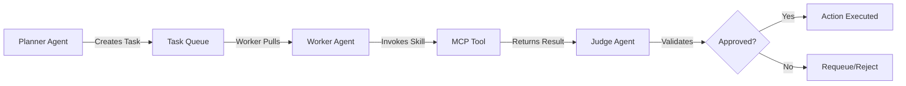

# Project Chimera: Agent Skills Catalog

**Document Status:** Ratified  
**Version:** 1.0.0  
**Last Updated:** 2026-02-05  
**Traceability:** Challenge Document Task 2.3, SRS Section 4.2-4.4

## Overview

This directory contains **Runtime Skills**—capability packages that Chimera agents use to execute tasks. Skills are invoked by Worker agents via MCP Tools during task execution. Each skill defines clear Input/Output contracts (JSON schemas) to ensure deterministic behavior and enable Judge validation.

**Key Principle:** Skills are **not** developer tools. They are runtime capabilities used by Chimera agents (Planner-Worker-Judge) to perform their autonomous operations.

**Reference:** `research/tooling_strategy.md` for distinction between Developer MCPs and Runtime Skills.

## Skill Architecture

### Skill Structure

Each skill follows this structure:
```
{skill_name}/
├── README.md              # Skill documentation
├── input_schema.json      # JSON Schema for input parameters
├── output_schema.json     # JSON Schema for output results
└── implementation.py      # (Future: Implementation code)
```

### Skill Invocation Flow



## Critical Skills

### 1. trend_fetcher

**Purpose:** Fetches and analyzes trending topics from multiple sources (news, social media, market data) via MCP Resources.

**Use Case:** Planner Agent uses this skill to discover relevant trends for content creation campaigns.

**Directory:** `skills/trend_fetcher/`

### 2. content_generator

**Purpose:** Generates multi-modal content (text, image, video) based on trends and persona constraints.

**Use Case:** Worker Agent uses this skill to create social media posts, images, and short videos.

**Directory:** `skills/content_generator/`

### 3. engagement_manager

**Purpose:** Manages social media engagement including replies, comments, and interaction analysis.

**Use Case:** Worker Agent uses this skill to respond to audience interactions and build engagement.

**Directory:** `skills/engagement_manager/`

## Contract Validation

All skill inputs and outputs MUST validate against their respective JSON schemas. The Judge Agent uses these schemas to verify Worker output before approval.

```python
# Example validation
from jsonschema import validate
import json

with open('skills/trend_fetcher/output_schema.json') as f:
    schema = json.load(f)

validate(instance=worker_output, schema=schema)
```

## Adding New Skills

1. Create a new directory under `skills/`
2. Define `input_schema.json` with JSON Schema draft-07
3. Define `output_schema.json` with JSON Schema draft-07
4. Document the skill in `README.md`
5. Add tests to `tests/test_skills_interface.py`
